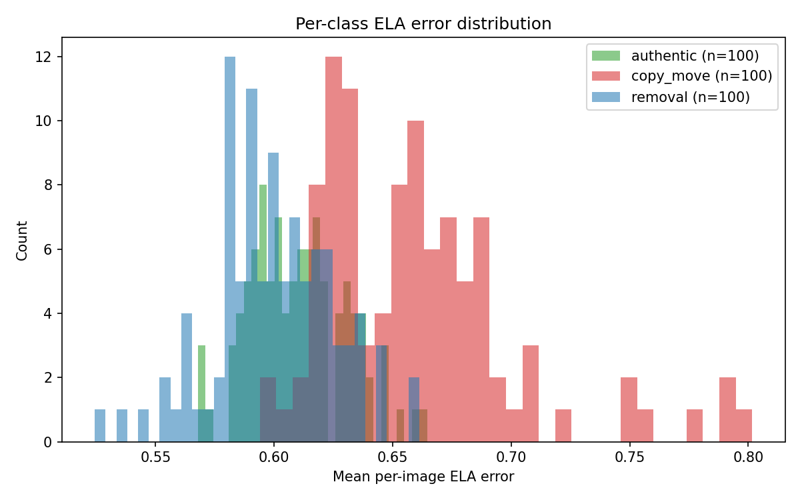
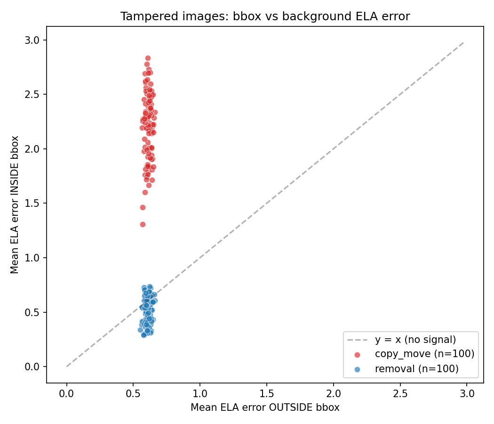
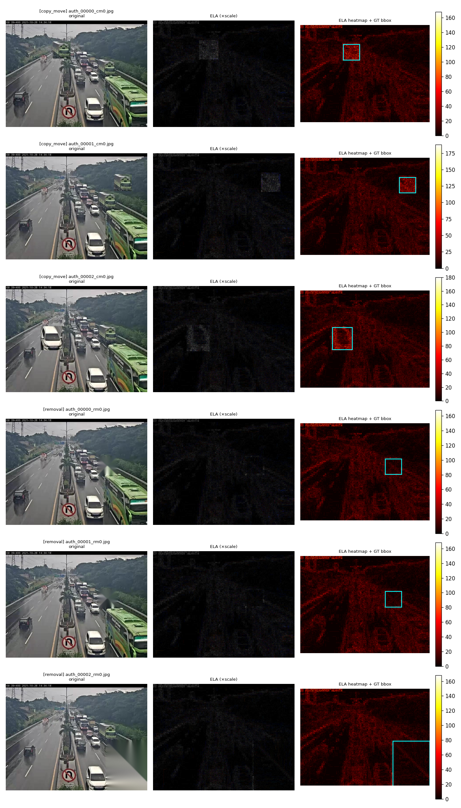
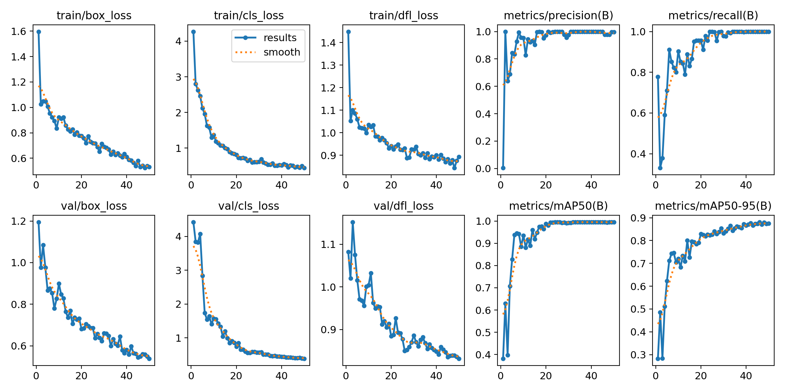
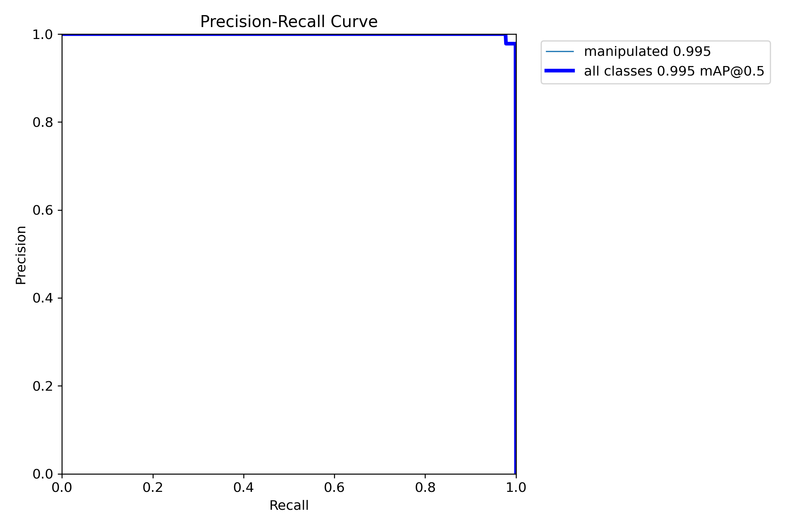
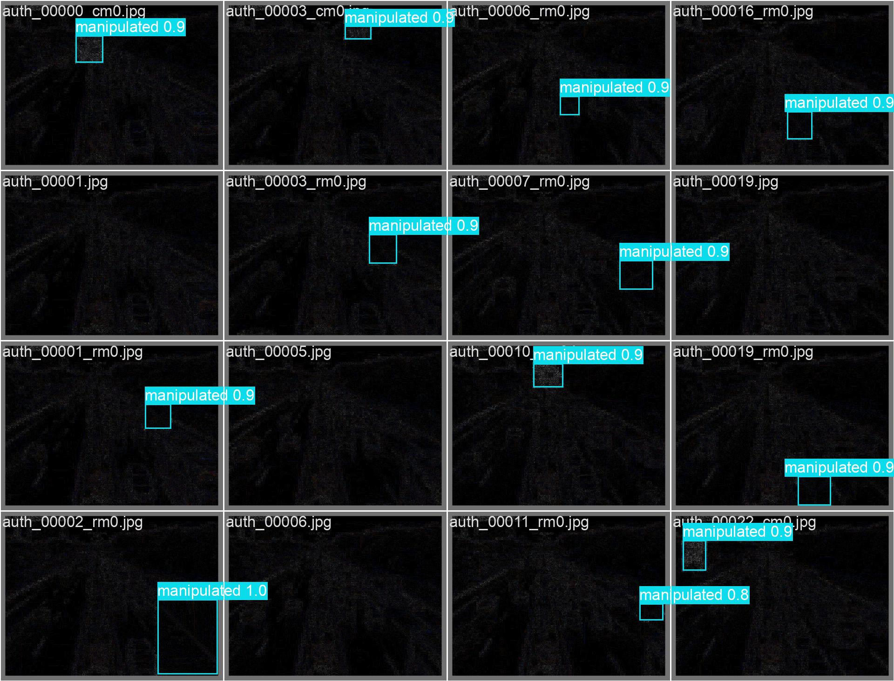

# Pilot experiment results

This file is regenerated alongside `metrics.json` and the figures under
`reports/figures/`. Numbers below are from the most recent run.

## Setup

| Field | Value |
|-------|-------|
| Source | Roboflow Universe `roboflow-100/vehicles-q0x2v` v2 (yolov8 export) |
| Authentic images | **100** |
| Tampered images | **200** (100 copy-move + 100 inpainting removal) |
| Source resolution | 480×640 px (Roboflow preprocessing — see README) |
| Authentic JPEG quality | 95 (PIL, `subsampling=0`) |
| Tampered JPEG quality | 95 (identical encoder/quality — control) |
| ELA recompression quality | 90 |
| ELA scaling factor | 12 |
| Random seed | 42 |

## Recompression fidelity

The first hypothesis to verify is that ELA's recompression step is in fact
a *low-error* operation on authentic images — otherwise the "error" we
measure on tampered images would be dominated by JPEG noise.

| Metric | Mean | Std |
|--------|------|------|
| PSNR (orig vs JPEG-90) | **47.53 dB** | 0.19 |
| SSIM (orig vs JPEG-90) | **0.9972** | 6.3e-05 |

PSNR > 47 dB and SSIM > 0.99 confirm that the recompression introduces
visually negligible error. Any large pixel difference therefore reflects
local discontinuities — exactly what ELA is designed to surface.

## Image-level ELA error distribution

|  | Mean ELA error (raw, pre-scale) |
|---|---|
| Authentic (n=100) | 0.610 |
| Tampered total (n=200) | 0.630 |
| — copy-move (n=100) | 0.654 |
| — removal (n=100)   | 0.605 |

At image level the manipulated and authentic distributions overlap
significantly. Image-level statistics are *not* a good standalone classifier
for these manipulations.



## Region-level ELA error (the actual ELA hypothesis)

The interesting question is whether the ELA error *concentrates inside the
manipulated bbox* relative to the rest of the image.

| Kind | n | Inside bbox | Outside bbox | Inside/Outside | % with inside > outside |
|------|---|-------------|--------------|----------------|--------------------------|
| copy-move | 100 | **2.205** | 0.612 | **3.60×** | **100.0 %** |
| removal   | 100 | **0.505** | 0.606 | **0.83×** | 21.0 % |
| both      | 200 | 1.355 | 0.609 | 2.22× | 60.5 % |

Two empirical findings:

1. **Copy-move is essentially trivial for ELA.** Every single copy-move
   sample (100/100) had a higher mean ELA error inside its bbox than
   outside, with an average ratio of 3.6×.
2. **Inpainting-based removal inverts the polarity.** Inpainted regions are
   *smoother* than the surrounding texture, so they compress more
   uniformly and carry **less** ELA error. Only 21 % of removal samples
   had inside > outside, consistent with the expected inverted signal.



The bimodal scatter visualises both behaviours — copy-move stretched far
above the y=x line, removal compressed slightly below it.

## Visual examples



The first three rows are copy-move: the GT bbox (cyan) clearly aligns
with a hot region in the ELA heatmap. The last three are removal: the
inpainted bbox shows up as a *darker*, smoother patch, confirming the
ratio inversion above.

## Implications for downstream YOLO training

Because ELA exhibits **opposite polarities** for copy-move and removal,
training a single YOLO detector on the union of the two sets is harder than
training on either alone. We still treat them as a single
`manipulated` class so the model has to learn both polarities; class
imbalance and harder removal cases will dominate the failure modes.

## YOLOv8 detector

YOLOv8n, 50 epochs, `imgsz=640`, `batch=8`, `device=cpu`, AdamW
auto-selected by Ultralytics, total wall-time **1.63 h** on a 2-core
EPYC 7763 VM. Training set 240 images / val set 60 images (45 manipulated
instances + 15 background-only).

| Metric | Value |
|--------|-------|
| **mAP@0.5** | **0.9946** |
| **mAP@0.5:0.95** | **0.8806** |
| **Precision** | **0.9770** |
| **Recall** | **1.0000** |

The detector reaches near-saturation on val by ~epoch 20 and continues
refining mAP50-95 (a stricter IoU criterion) up to epoch 49.





### Validation prediction sample

The validation grid below shows that the detector:

* fires on copy-move regions (e.g. `auth_00000_cm0`, `auth_00022_cm0`),
* fires on removal/inpainted regions (e.g. `auth_00006_rm0`,
  `auth_00010_rm0`, `auth_00019_rm0`), and
* correctly produces no detections on authentic images
  (`auth_00001`, `auth_00005`, `auth_00006`, `auth_00019`).

Despite ELA's *inverted* polarity for inpainting (lower error, not
higher), the network learns both signatures simultaneously when
trained on the union of the two manipulation classes.



## Reproducing

```bash
export ROBOFLOW_API_KEY=...
python scripts/run_pipeline.py --num-images 100 --epochs 50 --imgsz 640
```
